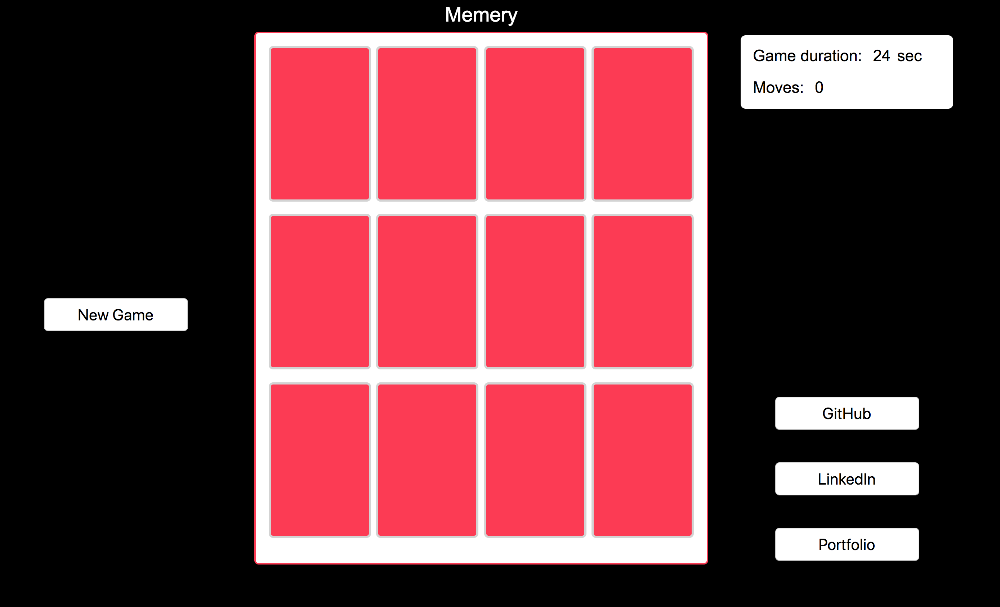

# Memery

Memery is a game inspired by the classic card game Memory. It was built using vanilla JavaScript! <a href="http://kevinnn.co/memery/" target="_blank">Play Memery here!</a>

## Gameplay

Memery is a card game in which all the cards are placed face down. The values of the cards will be some of your familiar internet memes. The player wins the game when all pairs of cards have been found. Until then, the locations of non-matching pairs of cards will be revealed face-up and then turned face-down.

How good is your memery?

## Look and Feel

The simple color scheme was chosen to distract the player as little as possible. The internet memes also provide the user an enjoyable experience!

## Future Plans

More memes, more cards, and ability for users to pick their own memes. Maybe chillstep music as well.
